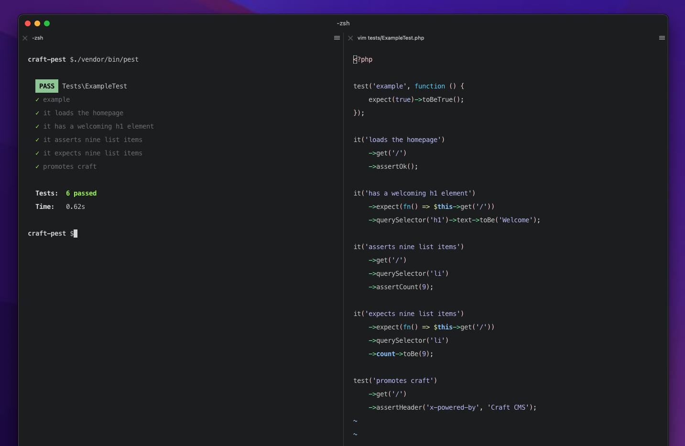

# Pest for Craft CMS

```shell
composer require markhuot/craft-pest --dev
./craft plugin/install pest
./craft pest/test
```

Handles the setup and installation of [Pest](https://pestphp.com) in to [Craft CMS](https://craftcms.com). This allows you to write tests that look something like this!

```php
it('loads the homepage')
    ->get('/')
    ->assertOk();

it('has a welcoming h1 element')
    ->expect(fn() => $this->get('/'))
    ->querySelector('h1')->text->toBe('Welcome');

it('asserts nine list items')
    ->get('/')
    ->querySelector('li')
    ->assertCount(9);

it('expects nine list items')
    ->expect(fn() => $this->get('/'))
    ->querySelector('li')
    ->count->toBe(9);

it('promotes craft')
    ->get('/')
    ->assertHeader('x-powered-by', 'Craft CMS');

it('shows news on the homepage', function() {
    $titles = News::factory()->count(3)->create()->title;

    expect($this->get('/')->querySelector('.news__title'))
        ->count->toBe(3)
        ->text->sequence(...$titles);
});
```

## Factories

With Factories you create and persist fake data in your database.

By using the `RefreshesDatabase` trait, all changes are reverted to the previous state.


```php
<?php

uses(\markhuot\craftpest\test\RefreshesDatabase::class);

it('creates 3 articles', function() {
    $enties = \markhuot\craftpest\factories\Entry::factory()
        ->count(3)
        ->section('articles')
        ->create();

    expect($enties)->toHaveCount(3);
});

```


